# 00 — Overview, Scope & Phasing

## 1. Objective

Provide a professional **Training Management Module** for TASAF / CoreMIS that lets
users:

- Create, edit, view, and manage trainings (with a real status workflow, not bare CRUD)
- Schedule trainings and view them in a calendar / weekly view
- Assign trainers and supporting staff, reusing trainer profiles
- Track participants and attendance
- Upload training materials and post-training evidence/reports
- Be warned about scheduling conflicts (trainer / venue / staff)
- Link trainings to TASAF programme areas and the openIMIS location hierarchy
- Review a summary dashboard

## 2. Design principles

1. **openIMIS-native.** Mirror existing modules (`payment_cycle`, `payroll`,
   `individual`, `tasaf_payment`). No bespoke frameworks.
2. **UUID + audit + soft delete.** All entities extend `core.models.HistoryModel`
   (UUID PK, `is_deleted`, `version`, `json_ext`, `user_created/updated`,
   `date_created/updated`).
3. **Configurable, not hardcoded.** Programme areas, roles, statuses live in DB /
   module config — never only in the frontend.
4. **Phase-2-ready.** Extension points (`json_ext`, nullable planned/actual fields,
   FK-friendly status model, cohort hook) are described in
   [08-phasing-roadmap.md](08-phasing-roadmap.md). Phase 1 must not block them.
5. **Don't break existing modules.** Additive only: new BE app + new FE module +
   two registration edits (`openimis.json`, `modules-requirements.txt`).

## 3. Scope — Phase 1 (build now)

| Area | Phase 1 deliverable |
|------|---------------------|
| Training CRUD | Create / edit / view / list / soft-delete, filters + pagination |
| Programme area | `TrainingCategory` (a.k.a. programme/business area), configurable |
| Location & PAA | FK to `location.Location`, plus PAA reference; region/district/ward filters |
| Trainer profiles | `TrainerProfile` CRUD, internal/external, reusable |
| Assignments | `TrainingAssignment` — trainer/staff + role + status |
| Conflict warning | `trainingConflicts` query + hard-block on save for trainer/venue overlaps |
| Calendar | Month / week / (day) views, status colouring, click-through, filters |
| Weekly view | This-week / next-week / ongoing / completed / cancelled buckets |
| Materials | `TrainingMaterial` upload (PDF/Doc/PPT/image) via DRF endpoint |
| Participants & attendance | `TrainingParticipant` with participant type + attendance status |
| Evidence/reports | `TrainingEvidence` upload (report, attendance sheet, photos, …) |
| Status workflow | Draft→Submitted→Approved/Rejected→Scheduled→Ongoing→Completed→Closed / Cancelled |
| Dashboard | Summary cards + by-status + by-programme-area |
| Permissions | `18xxxx` rights, role-gated menus/routes |

## 4. Scope — Phase 2 (design only, do **not** implement now)

Evaluation/feedback, certificate generation, plan-vs-actual, budget/cost tracking,
action points/follow-up, training-needs assessment, performance-indicator linkage,
notifications/reminders, cohorts/batches/waves, mobile/offline attendance.

See [08-phasing-roadmap.md](08-phasing-roadmap.md) for the exact extension strategy.

## 5. Phasing at a glance

```mermaid
flowchart LR
    subgraph P1["PHASE 1 — Core usable module"]
        A[Training CRUD + Status workflow]
        B[Category / Programme Area]
        C[Trainer Profiles]
        D[Assignments]
        E[Participants & Attendance]
        F[Materials & Evidence upload]
        G[Conflict detection]
        H[Calendar + Weekly view]
        I[Dashboard]
    end
    subgraph P2["PHASE 2 — Enhancements (designed, not built)"]
        J[Evaluation / Feedback]
        K[Certificates]
        L[Plan vs Actual]
        M[Budget & Cost]
        N[Action Points]
        O[Needs Assessment]
        P[Performance linkage]
        Q[Notifications]
        R[Cohorts / Waves]
    end
    P1 -->|extension points: json_ext, nullable planned/actual, status table, cohort FK| P2
```

## 6. Glossary

| Term | Meaning |
|------|---------|
| **PAA** | Programme Area / Productive Asset Area — TASAF operational area linked to a location |
| **Programme area** | TASAF business area a training belongs to (Targeting, Payment, Grievance, …) — modelled as `TrainingCategory` |
| **PMT / Registry / Paylist** | Existing TASAF/CoreMIS concepts the trainings often relate to |
| **Maker-checker** | openIMIS `tasks_management` approval pattern (referenced, optional for status workflow) |
| **`HistoryModel`** | openIMIS core base model: UUID PK + history + soft delete + audit |
