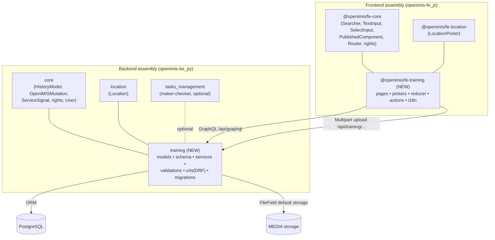
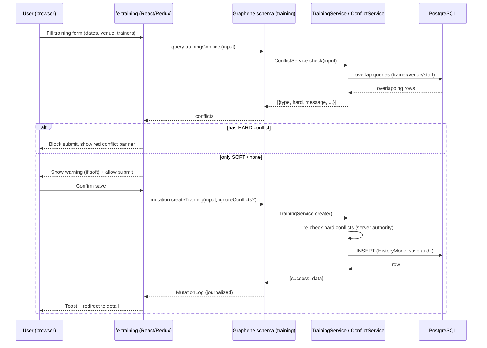

# 01 — Architecture & Integration

## 1. Where the module sits in openIMIS

openIMIS is an **assembly of independently versioned modules**. The backend mounts
Django apps listed in `openimis-be_py/openimis.json`; the frontend mounts npm packages
listed in `openimis-fe_js/openimis.json`. The Training Module adds **one backend app**
and **one frontend package** and registers them in those two manifests — nothing else
in the platform changes.



**Plain-text fallback:** FE `fe-training` depends on `fe-core` + `fe-location`, talks
to BE `training` over GraphQL (CRUD/queries) and a DRF multipart endpoint (file
upload). BE `training` depends on `core` + `location` (+ optional `tasks_management`),
persists to PostgreSQL and stores files via Django default storage.

## 2. Backend app layout

```
openimis-be-training_py/
├── setup.py                      # pip-installable package (mirrors payment_cycle)
├── README.md
├── docs/                         # ← this design documentation
└── training/
    ├── __init__.py
    ├── apps.py                   # TrainingConfig: DEFAULT_CONFIG + rights + ready()
    ├── models.py                 # 7 entities + per-entity *Mutation journal models
    ├── gql_queries.py            # DjangoObjectType per entity + summary/conflict types
    ├── gql_mutations.py          # Create/Update/Delete + status-action mutations
    ├── schema.py                 # Query + Mutation assembled into openIMIS schema
    ├── services.py               # *Service (BaseService) + ConflictService + SummaryService
    ├── validations.py            # *Validation (unique code, exists, whitespace)
    ├── apps_signals/ or signals/ # bind_service_signals() (optional tasks hook)
    ├── urls.py                   # DRF upload/download endpoints (materials, evidence)
    ├── views.py                  # DRF APIViews for multipart upload + file download
    ├── admin.py                  # Django admin registration
    ├── migrations/
    │   ├── 0001_initial.py       # generated by makemigrations
    │   └── 0002_training_rights.py  # data migration: grant rights to IMIS admin role
    └── tests/
        └── test_services.py
```

## 3. Frontend module layout

```
openimis-fe-training_js/
├── package.json                  # @openimis/fe-training
├── rollup.config.js / .babelrc
└── src/
    ├── index.js                  # DEFAULT_CONFIG: routes, reducer, menu, refs, pickers
    ├── constants.js              # RIGHT_* codes, route names, enums
    ├── reducer.js                # store shape + REQUEST/SUCCESS/ERROR handling
    ├── actions.js                # graphql() action creators + projections
    ├── pages/
    │   ├── TrainingsPage.js          # list (Searcher)
    │   ├── TrainingPage.js           # form (details + assignments + participants + uploads + conflicts)
    │   ├── TrainerProfilesPage.js    # list
    │   ├── TrainerProfilePage.js     # form/detail
    │   ├── TrainingCalendarPage.js   # month/week/day calendar
    │   └── TrainingDashboardPage.js  # summary cards + breakdowns
    ├── components/                # Searcher, Filter, HeadPanel, sub-panels, calendar grid
    ├── pickers/                   # StatusPicker, CategoryPicker, TrainerPicker, RolePicker
    └── translations/en.json
```

## 4. Request flow — create a training (with conflict pre-check)



> The server **re-runs** the hard-conflict check inside the mutation; the frontend
> pre-check is for UX only and is never the source of truth.

## 5. Cross-cutting conventions reused (not reinvented)

| Concern | Reused from | Notes |
|---------|-------------|-------|
| Base model | `core.models.HistoryModel` | UUID, soft delete, audit, `json_ext` |
| Mutation base | `core.schema.OpenIMISMutation`, `core.gql.gql_mutations.base_mutation.*` | journaling via `*Mutation.object_mutated` |
| Query field | `core.schema.OrderedDjangoFilterConnectionField` | filtering + ordering + paging |
| Service base | `core.services.BaseService` + `@register_service_signal` | uniform `{success,error,data}` |
| Validation | `core.validation.*` mixins | unique code, exists, whitespace |
| Rights | `core` rights + `apps.py DEFAULT_CONFIG` | `MMEEAA`; data migration grants to admin role |
| Location | `location.models.Location` + FE `location.LocationPicker` | Region→…→Village hierarchy |
| File upload | DRF `APIView` + Django default storage (`FileField`) | same shape as `payment_cycle` DRF views |
| Date/time | `core.fields.DateTimeField` | tz-aware, consistent with platform |
| FE inputs | `@openimis/fe-core` `TextInput`/`SelectInput`/`PublishedComponent` | never raw MUI inputs |
| FE menu | `invoice.MainMenu` contribution | rights-filtered entries |
| Optional approval | `tasks_management` | status workflow can later route Submit→Approve through maker-checker |
```
