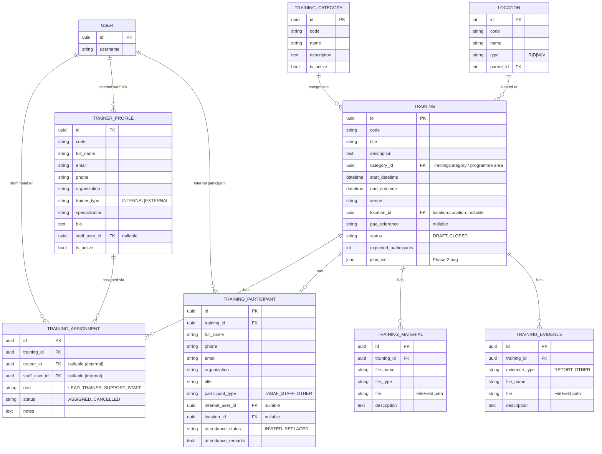
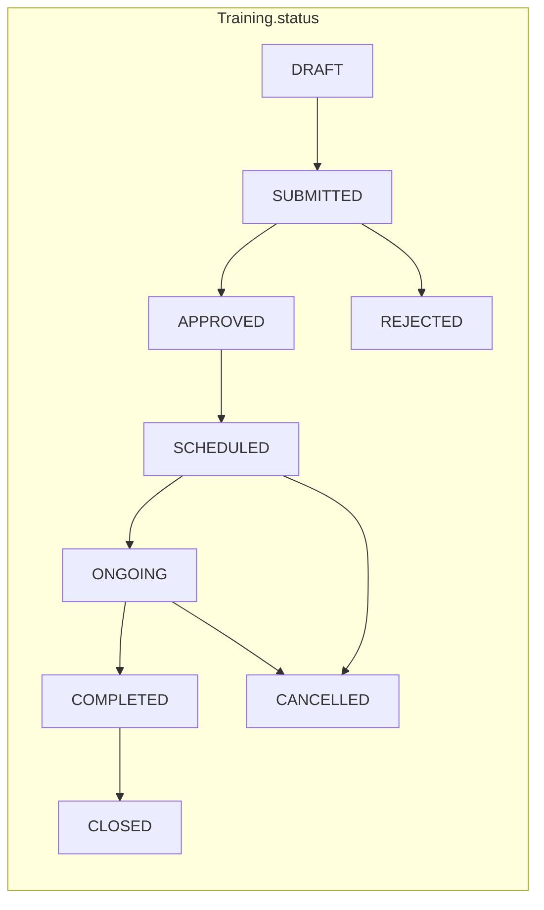

# 02 — Data Model

All entities extend **`core.models.HistoryModel`**, which contributes:

| Field | Type | Notes |
|-------|------|-------|
| `id` | UUID | primary key (`db_column='UUID'`) |
| `is_deleted` | bool | **soft delete** (`db_column='isDeleted'`) |
| `json_ext` | JSON | extension bag — **Phase-2 extension point** |
| `version` | int | optimistic concurrency |
| `date_created` / `date_updated` | datetime | audit timestamps |
| `user_created` / `user_updated` | FK → `core.User` | audit users → **"Created by / Updated by"** |

Plus a Django `simple_history` `Historical<Model>` shadow table per entity for full
change history. Every entity also has a `<Entity>Mutation` link table
(`UUIDModel + ObjectMutation`) joining it to `core.MutationLog` for
`client_mutation_id` journaling — exactly like `PaymentCycleMutation`.

> **Convention:** all FKs (cross-module *and* intra-module) use
> `on_delete=models.DO_NOTHING` to respect soft delete and avoid cascade surprises.

## 1. Entity Relationship Diagram (Phase 1)

## 2. Model-by-model field reference

### 2.1 `TrainingCategory` (programme / business area)
Configurable list seeded with the TASAF programme areas (Targeting/Registry,
Enrollment, Payment, Grievance, Public Works, Livelihoods, Case Management, M&E,
Environmental & Social Safeguards, Data Quality/MIS, Community/Behaviour Change,
General Administration). Seeded by a data migration so it is **not** hardcoded in FE.

| Field | Type | Req | Notes |
|-------|------|-----|-------|
| `code` | char(255) | ✓ | unique business code, e.g. `PAY` |
| `name` | char(255) | ✓ | display name |
| `description` | text | | |
| `is_active` | bool | | default `True` |

### 2.2 `TrainerProfile`
| Field | Type | Req | Notes |
|-------|------|-----|-------|
| `code` | char(255) | ✓ | unique |
| `full_name` | char(255) | ✓ | |
| `email` | char(255) | | |
| `phone` | char(50) | | |
| `organization` | char(255) | | department/org |
| `trainer_type` | char | ✓ | `INTERNAL` / `EXTERNAL` |
| `specialization` | char(255) | | |
| `bio` | text | | profile summary |
| `staff_user` | FK→`core.User` | | nullable, set when internal |
| `is_active` | bool | | default `True` |

### 2.3 `Training`
| Field | Type | Req | Notes |
|-------|------|-----|-------|
| `code` | char(255) | ✓ | unique reference number |
| `title` | char(255) | ✓ | |
| `description` | text | | |
| `category` | FK→`TrainingCategory` | | programme area |
| `start_datetime` | `core.fields.DateTimeField` | ✓ | tz-aware |
| `end_datetime` | `core.fields.DateTimeField` | ✓ | tz-aware; validated `>= start` |
| `venue` | char(255) | | free-text venue/room |
| `location` | FK→`location.Location` | | Region→…→Village/Shehia |
| `paa_reference` | char(255) | | PAA code/label (FK-ready, see §4) |
| `status` | char | ✓ | see [06-workflow-status.md](06-workflow-status.md), default `DRAFT` |
| `expected_participants` | int | | nullable |

Indexes on `code`, `status`, `category`, `location`, `start_datetime`, `end_datetime`
(filtering + calendar range queries + conflict detection).

### 2.4 `TrainingAssignment`
| Field | Type | Req | Notes |
|-------|------|-----|-------|
| `training` | FK→`Training` | ✓ | |
| `trainer` | FK→`TrainerProfile` | | external/reusable trainer |
| `staff_user` | FK→`core.User` | | internal staff/facilitator |
| `role` | char | ✓ | `LEAD_TRAINER`,`ASSISTANT_TRAINER`,`FACILITATOR`,`COORDINATOR`,`OBSERVER`,`SUPPORT_STAFF` |
| `status` | char | ✓ | `ASSIGNED`,`CONFIRMED`,`DECLINED`,`REPLACED`,`CANCELLED` |
| `notes` | text | | |

Constraint (app-level): at least one of `trainer` / `staff_user` is set.

### 2.5 `TrainingParticipant`
| Field | Type | Req | Notes |
|-------|------|-----|-------|
| `training` | FK→`Training` | ✓ | |
| `full_name` | char(255) | ✓ | |
| `phone` / `email` | char | | |
| `organization` / `title` | char | | |
| `participant_type` | char | ✓ | `TASAF_STAFF`,`PAA_REP`,`CMC_MEMBER`,`LGA_OFFICER`,`ENUMERATOR`,`SUPERVISOR`,`COMMUNITY_FACILITATOR`,`TRAINER`,`OTHER` |
| `internal_user` | FK→`core.User` | | nullable |
| `location` | FK→`location.Location` | | nullable |
| `attendance_status` | char | ✓ | `INVITED`,`CONFIRMED`,`ATTENDED`,`ABSENT`,`REPLACED` |
| `attendance_remarks` | text | | |

A signed attendance sheet is stored as a `TrainingEvidence` of type
`ATTENDANCE_SHEET` (no separate model needed).

### 2.6 `TrainingMaterial`
| Field | Type | Req | Notes |
|-------|------|-----|-------|
| `training` | FK→`Training` | ✓ | |
| `file_name` | char(255) | ✓ | |
| `file_type` | char(100) | | MIME / extension |
| `file` | FileField | ✓ | `upload_to='training/materials/%Y/%m/'` |
| `description` | text | | |
| *uploaded_by* | = `user_created` | | from HistoryModel |
| *uploaded_date* | = `date_created` | | from HistoryModel |

### 2.7 `TrainingEvidence`
Same shape as `TrainingMaterial` plus `evidence_type`
(`REPORT`,`ATTENDANCE_SHEET`,`PHOTO`,`SIGNED_FORM`,`EVALUATION_SUMMARY`,`TRAINER_REPORT`,`OTHER`).
Upload path `upload_to='training/evidence/%Y/%m/'`. Material and evidence share the
same DRF upload/download code path.

## 3. Enumerations (defined in models as `TextChoices`, surfaced to FE via config)

(Full transition rules in [06-workflow-status.md](06-workflow-status.md).)

## 4. Phase-2 extension points (designed in now, implemented later)

| Phase-2 need | How Phase-1 schema already supports it |
|--------------|----------------------------------------|
| **Evaluation / feedback** | New `TrainingEvaluation` FK→`Training`; pre/post scores in `json_ext` until promoted |
| **Certificates** | New `TrainingCertificate` FK→`TrainingParticipant`; `participant.attendance_status=ATTENDED` is the trigger |
| **Plan vs actual** | Add nullable `actual_start_datetime`, `actual_end_datetime`, `actual_participants`, `actual_venue`; Phase-1 fields become the "planned" values |
| **Budget & cost** | New `TrainingBudget` FK→`Training` (1-1); no Phase-1 change |
| **Action points** | New `TrainingActionPoint` FK→`Training` |
| **Needs assessment** | New `TrainingNeed` (optional FK→`Training`); `Training.json_ext.source_need_id` link |
| **Performance linkage** | `Training.json_ext.linked_indicators` + a future `TrainingImpact` table keyed by location/programme area |
| **Notifications** | Event hooks already emitted via service signals (`training_service.*`) — a Phase-2 consumer subscribes |
| **Cohorts / waves** | New `TrainingCohort`; `Training.cohort` FK added nullable (additive migration) |
| **Mobile/offline attendance** | `TrainingParticipant.json_ext` holds device/sync/QR metadata; no schema change |

Because every entity carries `json_ext` and new tables attach by FK, **all Phase-2
items are additive migrations** — no Phase-1 table is rewritten.

## 5. Table naming

`db_table = 'training_<Entity>'`, e.g. `training_Training`, `training_TrainerProfile`,
`training_TrainingParticipant`, matching the `prefix_EntityName` convention.
