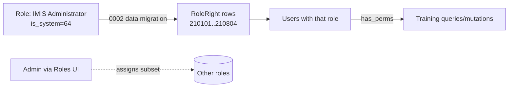

# 04 — Permissions / Rights

openIMIS rights are integer codes in the **`MMEEAA`** shape:
**module(2) + entity(2) + action(2)**. Existing ranges in this codebase:
`payment_cycle = 2000xx`, `tasaf_payment = 15xxxx`, `bill = 1561xx`.

The Training Module claims **module `21`**.

> Action digits: `01` search/view · `02` create · `03` update · `04` delete ·
> `10+` custom (approve, upload, …).

## 1. Rights matrix

| Right code | Constant (BE `apps.py` / FE `constants.js`) | Logical name | Entity |
|------------|---------------------------------------------|--------------|--------|
| `210101` | `gql_training_search_perms` / `RIGHT_TRAINING_SEARCH` | `training.view` | Training |
| `210102` | `gql_training_create_perms` / `RIGHT_TRAINING_CREATE` | `training.create` | Training |
| `210103` | `gql_training_update_perms` / `RIGHT_TRAINING_UPDATE` | `training.update` | Training |
| `210104` | `gql_training_delete_perms` / `RIGHT_TRAINING_DELETE` | `training.delete` | Training |
| `210110` | `gql_training_approve_perms` / `RIGHT_TRAINING_APPROVE` | `training.approve` | Training (workflow) |
| `210201` | `gql_training_category_search_perms` | `training.category.view` | TrainingCategory |
| `210202` | `gql_training_category_create_perms` | `training.category.manage` | TrainingCategory |
| `210203` | `gql_training_category_update_perms` | `training.category.manage` | TrainingCategory |
| `210204` | `gql_training_category_delete_perms` | `training.category.manage` | TrainingCategory |
| `210301` | `gql_trainer_search_perms` / `RIGHT_TRAINER_SEARCH` | `training.trainer.view` | TrainerProfile |
| `210302` | `gql_trainer_create_perms` | `training.trainer.manage` | TrainerProfile |
| `210303` | `gql_trainer_update_perms` | `training.trainer.manage` | TrainerProfile |
| `210304` | `gql_trainer_delete_perms` | `training.trainer.manage` | TrainerProfile |
| `210401` | `gql_assignment_search_perms` | `training.assignment.view` | TrainingAssignment |
| `210402` | `gql_assignment_create_perms` | `training.assignment.manage` | TrainingAssignment |
| `210403` | `gql_assignment_update_perms` | `training.assignment.manage` | TrainingAssignment |
| `210404` | `gql_assignment_delete_perms` | `training.assignment.manage` | TrainingAssignment |
| `210501` | `gql_material_search_perms` | `training.material.view` | TrainingMaterial |
| `210502` | `gql_material_upload_perms` / `RIGHT_MATERIAL_UPLOAD` | `training.material.upload` | TrainingMaterial |
| `210504` | `gql_material_delete_perms` | `training.material.manage` | TrainingMaterial |
| `210601` | `gql_dashboard_view_perms` / `RIGHT_DASHBOARD_VIEW` | `training.dashboard.view` / `training.calendar.view` | Dashboard/Calendar |
| `210701` | `gql_participant_search_perms` | `training.participant.view` | TrainingParticipant |
| `210702` | `gql_participant_create_perms` | `training.participant.manage` | TrainingParticipant |
| `210703` | `gql_participant_update_perms` | `training.attendance.manage` | TrainingParticipant |
| `210704` | `gql_participant_delete_perms` | `training.participant.manage` | TrainingParticipant |
| `210801` | `gql_evidence_search_perms` | `training.evidence.view` | TrainingEvidence |
| `210802` | `gql_evidence_upload_perms` / `RIGHT_EVIDENCE_UPLOAD` | `training.evidence.upload` | TrainingEvidence |
| `210804` | `gql_evidence_delete_perms` | `training.evidence.manage` | TrainingEvidence |

> The spec's slash-named rights (`training.view`, `training.calendar.view`, …) map to
> the numeric codes above; openIMIS stores the **numbers** in `core.RoleRight` and
> uses them in `user.has_perms([...])`.

## 2. Default config (`apps.py`)

Each `gql_*_perms` key in `DEFAULT_CONFIG` defaults to a list with its code (e.g.
`'gql_training_create_perms': ['210102']`) and is overridable per-deployment via
`core.ModuleConfiguration` (DB) — **nothing hardcoded beyond defaults**.

## 3. Role seeding (data migration `0002_training_rights.py`)

Grants the full set to the **IMIS Administrator** system role
(`is_system = 64`) — same approach as `payment_cycle`'s `0002_add_pc_rights_to_admin`.
Reversible (`remove_rights`). Other roles get rights assigned by admins through the
standard Roles UI.

## 4. Enforcement points

- **GraphQL resolvers/mutations:** `user.has_perms(TrainingConfig.<right>)` (raise `PermissionDenied`).
- **DRF upload/download views:** `permission_classes = [check_user_rights(TrainingConfig.<right>)]` (same as `payment_cycle` views).
- **Frontend menu/routes:** `filter: (rights) => rights.includes(RIGHT_*)` on the `invoice.MainMenu` contribution and conditional route registration — UI is hidden when the right is absent (defence-in-depth; server remains authoritative).
