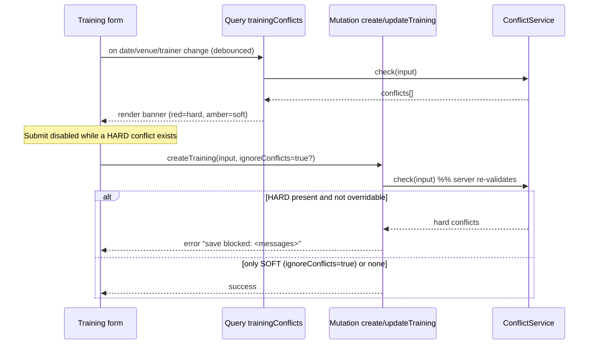

# 05 — Conflict Detection

## 1. Rules

| # | Conflict | Severity | Effect on save |
|---|----------|----------|----------------|
| 1 | **Same trainer** assigned to another training with overlapping `[start,end]` | **HARD** | Blocks save |
| 2 | **Same venue** booked for another training with overlapping `[start,end]` | **HARD** | Blocks save |
| 3 | **Same staff member** assigned to overlapping trainings | **HARD** | Blocks save |
| 4 | **Same location / PAA** has multiple trainings at the same time | **SOFT** | Warns only; save allowed |

A training is excluded from its own conflict set, and trainings with status
`CANCELLED` / `REJECTED` / `CLOSED` are ignored.

## 2. Overlap definition

Two intervals `[s1,e1]` and `[s2,e2]` overlap when **`s1 < e2` AND `s2 < e1`**
(touching endpoints — `e1 == s2` — do **not** conflict). Implemented as ORM filter:

```python
overlap = Q(start_datetime__lt=end) & Q(end_datetime__gt=start)
```

## 3. Algorithm (`ConflictService.check`)

```mermaid
flowchart TD
    Start([check(input)]) --> Base["base_qs = Training.objects\n.filter(is_deleted=False)\n.exclude(status in CANCELLED/REJECTED/CLOSED)\n.exclude(id == input.trainingId)\n.filter(start < end AND end > start)"]
    Base --> Venue{venue set?}
    Venue -- yes --> VQ["venue match (iexact) on base_qs\n→ HARD VENUE conflicts"]
    Venue -- no --> Trainer
    VQ --> Trainer{trainerIds?}
    Trainer -- yes --> TQ["assignments of those trainers\non overlapping trainings\n→ HARD TRAINER conflicts"]
    Trainer -- no --> Staff
    TQ --> Staff{staffUserIds?}
    Staff -- yes --> SQ["assignments of those staff\non overlapping trainings\n→ HARD STAFF conflicts"]
    Staff -- no --> Loc
    SQ --> Loc{locationId set?}
    Loc -- yes --> LQ["same location on base_qs\n→ SOFT LOCATION conflicts"]
    Loc -- no --> Done
    LQ --> Done([return conflicts list])
```

Each conflict is rendered into a human-readable message, e.g.:

> *"Conflict detected: Trainer **John Doe** is already assigned to Training **PAY-2026-014**
> from **10:00 to 13:00 on 2026-06-20**."*

## 4. Where it runs



- **Query `trainingConflicts`** — UX pre-check, debounced on the form.
- **Mutation create/update** — server-side authority. HARD conflicts always block;
  SOFT conflicts are allowed and merely returned/logged. `ignoreConflicts` only ever
  relaxes SOFT handling — it can **never** bypass a HARD conflict.

## 5. Configurability

`TrainingConfig.DEFAULT_CONFIG` exposes:
- `conflict_hard_types` (default `["TRAINER","VENUE","STAFF"]`)
- `conflict_soft_types` (default `["LOCATION"]`)
- `conflict_check_enabled` (default `True`)

so a deployment can, for example, downgrade STAFF to soft, or disable LOCATION
warnings, without code changes.

## 6. Edge cases handled

- Missing `end_datetime` or `end < start` → validation error (caught before conflict check).
- A training with no assignments yet → only venue/location rules apply.
- Trainer assigned as both LEAD and ASSISTANT on the same training → not a self-conflict.
- Bulk reschedule → conflict check re-runs per training on update.
