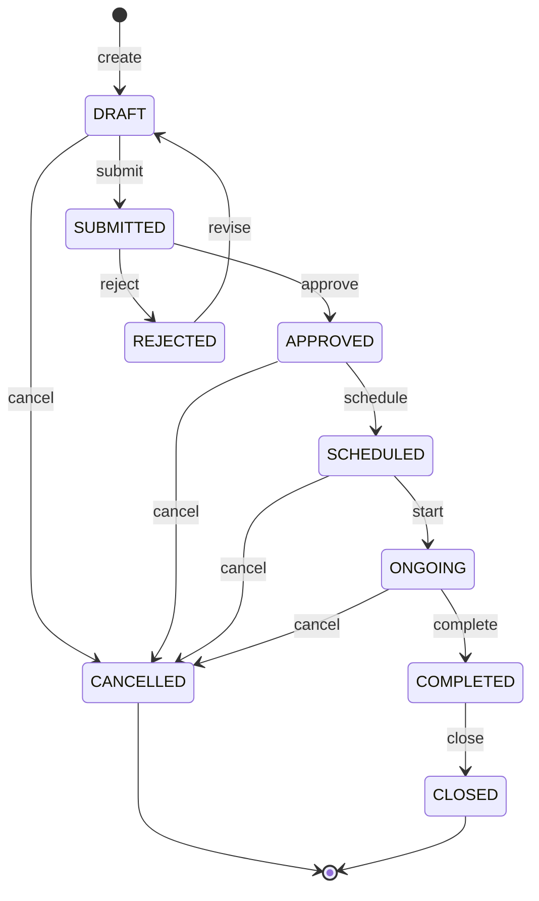
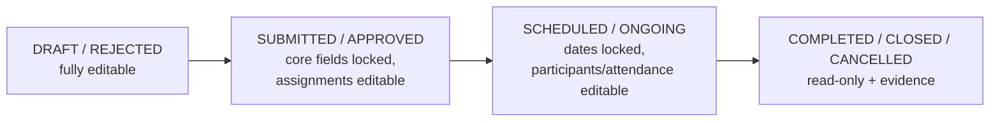

# 06 — Training Status Workflow

Training is **not** treated as plain CRUD. It carries a status with guarded
transitions. Phase 1 implements clean status transitions in the service layer; the
same `transition()` entry point can later be routed through `tasks_management`
maker-checker without changing the GraphQL surface.

## 1. States

| Status | Meaning |
|--------|---------|
| `DRAFT` | Being prepared; editable |
| `SUBMITTED` | Submitted for approval |
| `APPROVED` | Approved, ready to schedule |
| `REJECTED` | Rejected by approver (returns to author) |
| `SCHEDULED` | Dates/venue/trainers confirmed |
| `ONGOING` | Currently running |
| `COMPLETED` | Delivered |
| `CANCELLED` | Called off |
| `CLOSED` | Finalised after completion (evidence/report attached) |

## 2. State machine

## 3. Allowed transitions (enforced in `TrainingService.transition`)

| Action | Precondition (from) | Result (to) | Right | Extra guard |
|--------|---------------------|-------------|-------|-------------|
| submit | DRAFT | SUBMITTED | update | required fields present (title, dates, category) |
| approve | SUBMITTED | APPROVED | approve | approver ≠ author (configurable) |
| reject | SUBMITTED | REJECTED | approve | reason required (`json_ext.reject_reason`) |
| revise | REJECTED | DRAFT | update | — |
| schedule | APPROVED | SCHEDULED | update | **no HARD conflict** (re-checks ConflictService) |
| start | SCHEDULED | ONGOING | update | now ≥ start_datetime (configurable tolerance) |
| complete | ONGOING | COMPLETED | update | — |
| cancel | DRAFT/APPROVED/SCHEDULED/ONGOING | CANCELLED | update | reason recommended |
| close | COMPLETED | CLOSED | update | at least one evidence/report attached (configurable) |

Invalid transitions return a uniform service error
(`training_service.validation.invalid_status_transition`) — they never raise/500.

## 4. Editing rules by status

- **DRAFT / REJECTED** — every field editable.
- **SUBMITTED / APPROVED** — identity & schedule fields locked; assignments still editable.
- **SCHEDULED / ONGOING** — schedule locked; participants & attendance editable.
- **COMPLETED / CLOSED / CANCELLED** — read-only except evidence/report attachment.

(Lock granularity is config-driven via `TrainingConfig.editable_fields_by_status`.)

## 5. Phase-2 upgrade path

`transition(training, target, user, **ctx)` is the single chokepoint. To add
maker-checker later: bind `submit`/`approve` to a `tasks_management` task source
(`TrainingService` as the task handler, exactly like `PaymentCycleService`) and the
GraphQL mutations stay unchanged — they already delegate to the service.
