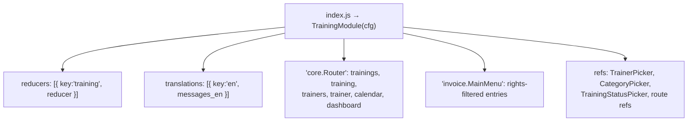

# 07 — Frontend Design (`openimis-fe-training_js`)

Mirrors `openimis-fe-payment_cycle_js`. Uses **only** `@openimis/fe-core` building
blocks (`Searcher`, `TextInput`, `SelectInput`, `PublishedComponent`,
`FormattedMessage`, `Contributions`, `helpers`) — never raw MUI inputs.

## 1. Module config (`src/index.js`)



Menu entries are contributed under a dedicated **`training.MainMenu`** key (each with a
stable `id` and `filter: rights => rights.includes(RIGHT_*)`): `training.trainings`,
`training.calendar`, `training.trainers`, `training.dashboard`.

**Dedicated top-level "Training" menu (config-driven).** This deployment uses the
`fe-core` `menus` config (`MainMenuBar`/`getMenuEntries`): the assembly pools entries
from every `*.MainMenu` key and the backend `core.ModuleConfiguration` row
`module='fe-core' → config.menus[]` decides the top-level grouping, order and icons by
matching each `submenus[].id` to an entry `id`. To surface Training as its own top menu,
add this object to that `menus` array (no extra FE code needed):

```json
{
  "position": 9,
  "id": "TrainingMainMenu",
  "name": "Training",
  "icon": "School",
  "description": "Training Management",
  "submenus": [
    { "position": 1, "id": "training.trainings" },
    { "position": 2, "id": "training.calendar" },
    { "position": 3, "id": "training.trainers" },
    { "position": 4, "id": "training.dashboard" }
  ]
}
```

The top-level `id` is arbitrary (like the existing `SocialProtectionMainMenu`); placement
is by the `submenus[].id` ↔ entry-`id` match. When `menus` config is present, **only**
entries listed in some menu's `submenus` are shown — so this config entry is required for
the Training links to appear.

## 2. Routes

| Route const | Path | Page | Right |
|-------------|------|------|-------|
| `ROUTE_TRAININGS` | `/trainings` | `TrainingsPage` (list) | `RIGHT_TRAINING_SEARCH` |
| `ROUTE_TRAINING` | `/trainings/training/:training_uuid?` | `TrainingPage` (form/detail) | search/create |
| `ROUTE_TRAINERS` | `/trainings/trainers` | `TrainerProfilesPage` | `RIGHT_TRAINER_SEARCH` |
| `ROUTE_TRAINER` | `/trainings/trainers/trainer/:trainer_uuid?` | `TrainerProfilePage` | trainer manage |
| `ROUTE_TRAINING_CALENDAR` | `/trainings/calendar` | `TrainingCalendarPage` | `RIGHT_DASHBOARD_VIEW` |
| `ROUTE_TRAINING_DASHBOARD` | `/trainings/dashboard` | `TrainingDashboardPage` | `RIGHT_DASHBOARD_VIEW` |

## 3. Screens

### TrainingsPage (list)
`Searcher` + `TrainingFilter` (search text, status, programme area/category, trainer,
location via `location.DetailedLocationFilter`/`LocationPicker`, date-range). Columns:
code, title, category, status (coloured chip), start, end, venue, participants.
Row actions: view / edit / soft-delete (with confirmation dialog). "Add" button → form.

### TrainingPage (form + detail)
Tabbed via `Contributions` (`training.TabPanel.label/panel`):
1. **Details** — code, title, description, `TrainingCategoryPicker`, start/end
   (`PublishedComponent pubRef="core.DatePicker"` date-time), venue,
   `location.LocationPicker`, PAA, status, expected participants.
2. **Conflict banner** — calls `trainingConflicts` (debounced); red (hard) blocks the
   Save button, amber (soft) is informational.
3. **Trainers & Staff** — assignment sub-table (`TrainerPicker`/staff `UserPicker`,
   `RolePicker`, status, notes).
4. **Participants & Attendance** — participant sub-table (type, attendance status,
   remarks) + optional CSV import + signed-sheet upload.
5. **Materials** — upload (multipart) + list with download links.
6. **Evidence / Reports** — upload (typed) + list.
7. **Status actions** — Submit / Approve / Reject / Schedule / Start / Complete /
   Cancel / Close buttons, shown per current status + right.

### TrainingDetailPage
Read-only roll-up of the same tabs + audit (created/updated by & date).

### TrainerProfilesPage / TrainerProfilePage
List + form (type, specialization, internal staff link, active flag). Detail shows the
trainer's assigned trainings (query `trainingAssignment` by `trainer_Id`).

### TrainingCalendarPage
Month / week / (day) grid built from `@material-ui` primitives (no new dependency).
Events coloured by status, click → `TrainingPage`. Filters: trainer, location,
category, status, date range. Data via `trainingCalendar(dateFrom,dateTo,…)`.

```mermaid
flowchart LR
    Toolbar[Month|Week|Day toggle + filters] --> Grid
    Grid[Calendar grid] -->|range| Action[fetchTrainingCalendar]
    Action --> Store[(redux: trainingCalendar)]
    Store --> Grid
    Grid -->|click event| Detail[history.push /trainings/training/:uuid]
```

### TrainingDashboardPage
Summary cards (total, this week, upcoming, ongoing, completed, cancelled, active
trainers) + **by-status** and **by-programme-area** breakdowns + a "this week / next
week" list. Data via `trainingSummary` and a range `trainingCalendar` call.

## 4. Redux store shape (`reducer.js`)

Per-list triad `fetching<X>/fetched<X>/error<X>`, `<x>` array, `<x>PageInfo`,
`<x>TotalCount`, plus `submittingMutation`/`mutation`:

```
trainings, training, trainerProfiles, trainerProfile,
trainingAssignments, trainingParticipants, trainingMaterials, trainingEvidence,
trainingConflicts, trainingSummary, trainingCalendar
```

Mutations dispatched via `dispatchMutationReq/Resp/Err`; `journalize(mutation)` on
completion (the `prevSubmittingMutationRef` pattern). IDs decoded with `decodeId`,
`rowIdentifier={(r)=>r.id}`.

## 5. i18n (`src/translations/en.json`)

All labels under the `training` module key. **TASAF-specific string overrides** belong
in `openimis-fe-language_en_tasaf_js`, never edited inside a canonical module's
`en.json` (project convention).

## 6. Pickers (reusable, registered as refs)
`TrainingStatusPicker`, `TrainingCategoryPicker`, `TrainerPicker`, `RolePicker`,
`ParticipantTypePicker`, `AttendanceStatusPicker` — `ConstantBasedPicker`/`SelectInput`
backed, options resolved from constants + i18n.
