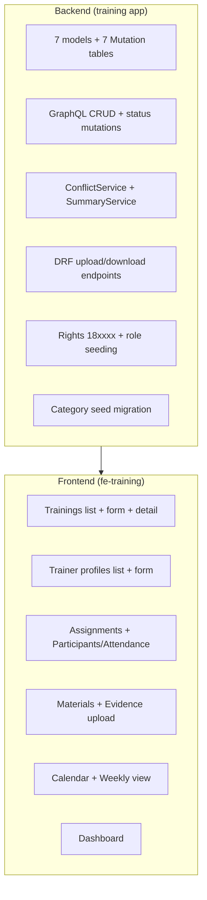

# 08 — Phasing & Roadmap

## 1. Phase 1 deliverables (build now)

| Capability | Phase 1 |
|------------|:------:|
| Training CRUD + filters/pagination | ✅ |
| Programme area / category (configurable) | ✅ |
| Location + PAA linkage & filters | ✅ |
| Trainer profiles | ✅ |
| Assignments (trainer/staff + role) | ✅ |
| Conflict warning (hard block / soft warn) | ✅ |
| Calendar (month/week/day) | ✅ |
| Weekly view | ✅ |
| Materials upload | ✅ |
| Participants & attendance | ✅ |
| Evidence/report upload | ✅ |
| Status workflow (Draft…Closed) | ✅ |
| Dashboard / summary | ✅ |

## 2. Phase 2 roadmap (design only — additive)

Each item is an **additive migration** + new service/GraphQL/screen. No Phase-1 table
is rewritten. Recommended sequencing:

```mermaid
flowchart LR
    A[1. Plan vs Actual\n+nullable actual_* fields] --> B[2. Evaluation/Feedback\nTrainingEvaluation]
    B --> C[3. Certificates\nTrainingCertificate]
    C --> D[4. Budget & Cost\nTrainingBudget]
    D --> E[5. Action Points\nTrainingActionPoint]
    E --> F[6. Needs Assessment\nTrainingNeed]
    F --> G[7. Cohorts/Waves\nTrainingCohort + Training.cohort FK]
    G --> H[8. Notifications\nservice-signal consumer]
    H --> I[9. Performance linkage\nTrainingImpact by location/area]
    I --> J[10. Mobile/Offline attendance\nQR + sync via json_ext]
```

## 3. Extension-point map (how Phase 1 anticipates Phase 2)

| Phase-2 feature | Phase-1 hook | Migration type |
|-----------------|--------------|----------------|
| Plan vs Actual | Phase-1 schedule = "planned"; add `actual_*` nullable | additive columns |
| Evaluation | `Training.json_ext.evaluation` interim; new FK table | additive table |
| Certificates | `participant.attendance_status == ATTENDED` trigger | additive table |
| Budget | 1-1 `TrainingBudget` FK | additive table |
| Action points | `TrainingActionPoint` FK | additive table |
| Needs assessment | `Training.json_ext.source_need_id` | additive table |
| Cohorts | `Training.cohort` nullable FK | additive column + table |
| Notifications | service signals `training_service.*` already emitted | consumer only |
| Performance linkage | `Training.json_ext.linked_indicators` | additive table |
| Mobile/offline | `participant.json_ext` device/QR/sync bag | no schema change |

## 4. Guardrails enforced in Phase 1 to keep Phase 2 cheap

1. **Every entity has `json_ext`** — interim storage before a field is "promoted" to a column.
2. **Status lives in one service method** (`transition`) — maker-checker/notifications attach there.
3. **Service signals on every create/update/delete** — notification & performance consumers subscribe without touching Phase-1 code.
4. **Uploads share one code path** — certificates/eval attachments reuse it.
5. **Category & roles are data, not code** — new programme areas/roles need no deploy.
