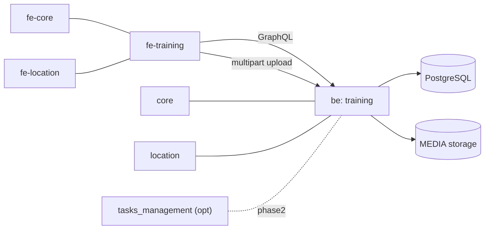
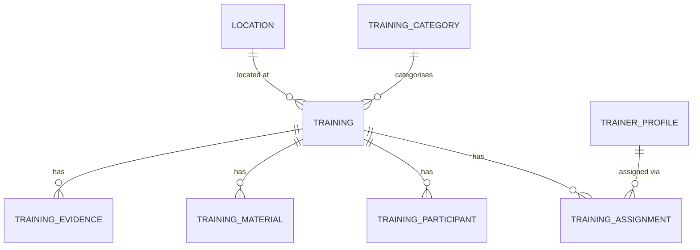
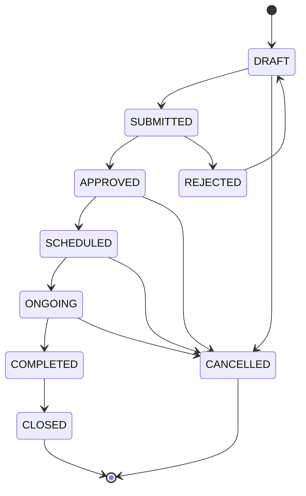
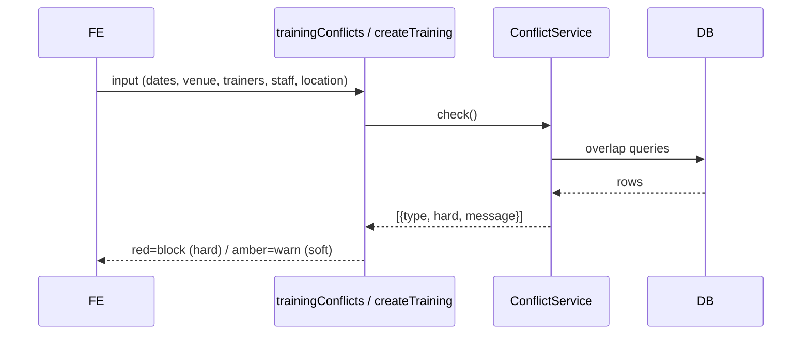

# Consolidated System Diagrams

Quick-reference copies of the key diagrams. Full context lives in the numbered docs.

## 1. High-level system context (ASCII fallback)

```
                +-------------------------------------------------------+
                |                 openIMIS Frontend (SPA)               |
                |   fe-core  |  fe-location  |  *** fe-training (NEW) ***|
                +------------------------+------------------------------+
                                         |  GraphQL  +  multipart upload
                                         v
                +------------------------+------------------------------+
                |                 openIMIS Backend (Django)             |
                |   core  |  location  |  tasks_management(opt)         |
                |                *** training (NEW) ***                 |
                |   models • schema • services • conflict • DRF upload  |
                +------------+-----------------------------+------------+
                             |                             |
                             v                             v
                      +------+------+              +-------+--------+
                      | PostgreSQL  |              | MEDIA storage  |
                      | training_*  |              | materials /    |
                      | tables      |              | evidence files |
                      +-------------+              +----------------+
```

## 2. Module integration (Mermaid)



## 3. ERD (Mermaid) — see 02-data-model.md for full attributes



## 4. Status state machine (Mermaid) — see 06-workflow-status.md



## 5. Conflict-check sequence (Mermaid) — see 05-conflict-detection.md


